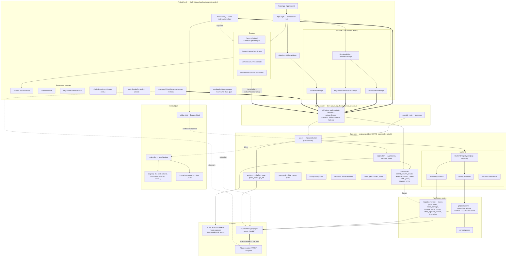

# fcast-android-sender — Architecture

Standalone Android **sender** app for the [FCast protocol](https://github.com/kodyka/fcast).
A thin Kotlin/Android shell hosts a Rust core (`fcastsender`, built as a `cdylib`)
that drives a Slint UI and a GStreamer/WebRTC media pipeline. The Kotlin and Rust
sides talk over a JNI boundary; media frames captured on the Android side are
pushed into the Rust media-graph runtime, encoded via GStreamer, and streamed
(WHEP/WebRTC or RTMP) to a discovered FCast receiver.

## Layers

**Android shell (Kotlin/Java).** `FcastApp` builds `AppGraph`, the single
composition root that wires the runtime bridge, secret store, and capture
coordinators. `MainActivity` hosts the Slint `NativeActivity` and forwards UI and
lifecycle events. Four foreground services back long-running work: screen
capture, the gst-pop host, the migration runtime host, and an AIDL codec
benchmark service. Capture coordinators feed raw frames; `FCastDiscoveryListener`
finds receivers over mDNS.

**JNI boundary.** `src/lib.rs` exports the `Java_org_fcast_android_sender_*`
symbols. `android_main` bootstraps the process (JavaVM, classloader, Slint event
loop), and the `jni_bridge` modules dispatch each native call into the core.

**Rust core (`android-sender` → `libfcastsender.so`).** `app.rs` is the
composition root; `application` holds app state. The `backend` layer exposes a
`MediaBackend` trait selected through a `BackendRegistry` with two
implementations — `gstpop` and `migration`. Cross-thread frame/event handoff uses
the global `FRAME_PAIR`, `FRAME_POOL`, and crossbeam channels.

**Workspace crates.** `gstpop-runtime` is an in-process gst-pop daemon plus
JSON-RPC client; `migration-runtime` is the node-based media-graph runtime
(sources, mixers, destinations, WHEP signaller compat). Both drive GStreamer.

**Slint UI.** `main.slint` defines `MainWindow`; `bridge.slint`'s `Bridge` global
is the property/callback contract between Rust and the ~35 pages.

**External.** FCast SDK crates (`fcast-protocol`, `fcast-sender-sdk`, `mcore`) are
git-pinned to `kodyka/fcast`. Encoding and transport run through GStreamer and
`gst-plugin-webrtc` (WHEP), terminating at a discovered FCast receiver or RTMP
endpoint.

## End-to-end data flow

Screen or camera frames are captured on the Android side, pushed across JNI
(`nativeProcessFrame`) into `FRAME_PAIR`, consumed by the migration-runtime media
graph (or the gst-pop path), encoded by GStreamer, and streamed via WHEP/WebRTC
or RTMP to a receiver discovered over mDNS. Control/state flows back up through
the `Bridge` global into the Slint UI.
