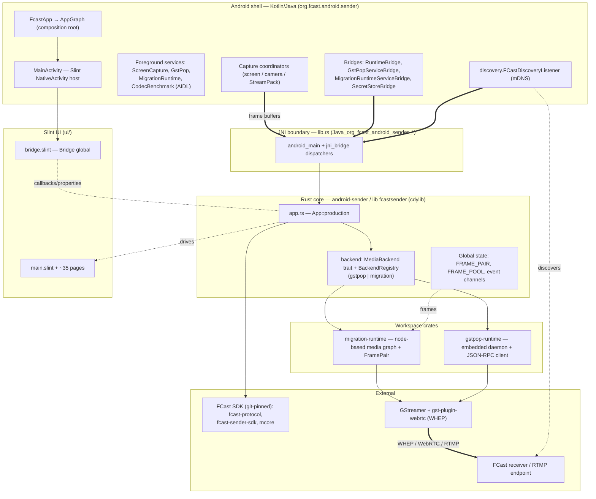

# Architecture overview

A thin Android shell (Kotlin/Java) hosts a Rust core built as a `cdylib`
(`libfcastsender.so`). The Kotlin and Rust sides talk over a JNI boundary; frames
captured on the Android side are pushed into the Rust media-graph runtime,
encoded via GStreamer, and streamed (WHEP/WebRTC or RTMP) to a discovered FCast
receiver. The full Mermaid diagram lives in
[`../../ARCHITECTURE.md`](../../ARCHITECTURE.md); this page summarizes the layers.

## Layered diagram

## Layers

**Android shell (Kotlin/Java).** `FcastApp` builds `AppGraph`, the single
composition root wiring the runtime bridge, secret store, and capture
coordinators. `MainActivity` hosts the Slint `NativeActivity`. Four foreground
services back long-running work (screen capture, gst-pop host, migration runtime
host, AIDL codec benchmark). `FCastDiscoveryListener` finds receivers over mDNS.

**JNI boundary.** `src/lib.rs` exports the `Java_org_fcast_android_sender_*`
symbols; `android_main` bootstraps the process and the `jni_bridge` modules
dispatch each native call into the core.

**Rust core (`android-sender` → `libfcastsender.so`).** `app.rs` is the
composition root; the `backend` layer exposes a `MediaBackend` trait selected via
a `BackendRegistry` with `gstpop` and `migration` implementations. Cross-thread
frame/event handoff uses the global `FRAME_PAIR`, `FRAME_POOL`, and crossbeam
channels.

**Workspace crates.** `gstpop-runtime` is an in-process gst-pop daemon plus
JSON-RPC client; `migration-runtime` is the node-based media-graph runtime
(sources, mixers, destinations, WHEP signaller compat). Both drive GStreamer.

**Slint UI.** `main.slint` defines `MainWindow`; `bridge.slint`'s `Bridge` global
is the property/callback contract between Rust and the ~35 pages.

**External.** FCast SDK crates (`fcast-protocol`, `fcast-sender-sdk`, `mcore`) are
git-pinned to `kodyka/fcast`. Encoding/transport run through GStreamer and
`gst-plugin-webrtc` (WHEP), terminating at a discovered receiver or RTMP endpoint.

## Directory responsibilities

| Path | Responsibility |
|---|---|
| `app/` | Android Gradle module: manifest, Kotlin/Java shell, JNI packaging, resources |
| `src/` | Main Rust crate `android-sender` — JNI exports, app logic, backends |
| `crates/` | Internal Rust runtimes: `migration-runtime`, `gstpop-runtime` |
| `ui/` | Slint UI: `main.slint`, `bridge.slint`, pages, components, theme, i18n |
| `vendor/` | Vendored `gstpop` crate for reproducible builds |
| `ci/` | Build + validation helper scripts, JNI symbol baseline |
| `scripts/` | Local developer scripts (build-deploy, smoke, slint-viewer checks) |
| `tests/` | Headless UI snapshot tests |
| `docs/` | Current documentation (this tree) |

## End-to-end data flow

Screen or camera frames are captured on the Android side, pushed across JNI
(`nativeProcessFrame`) into `FRAME_PAIR`, consumed by the migration-runtime media
graph (or the gst-pop path), encoded by GStreamer, and streamed via WHEP/WebRTC
or RTMP to a receiver discovered over mDNS. Control/state flows back up through
the `Bridge` global into the Slint UI.

## Native/JNI stability rule

Exported JNI symbol names (`Java_org_fcast_android_sender_*` in `src/lib.rs`) are
part of the app ABI. If they change intentionally, update `ci/jni-symbol-baseline.txt`
and explain why in the PR — the `symbol-stability` workflow diffs against it.
