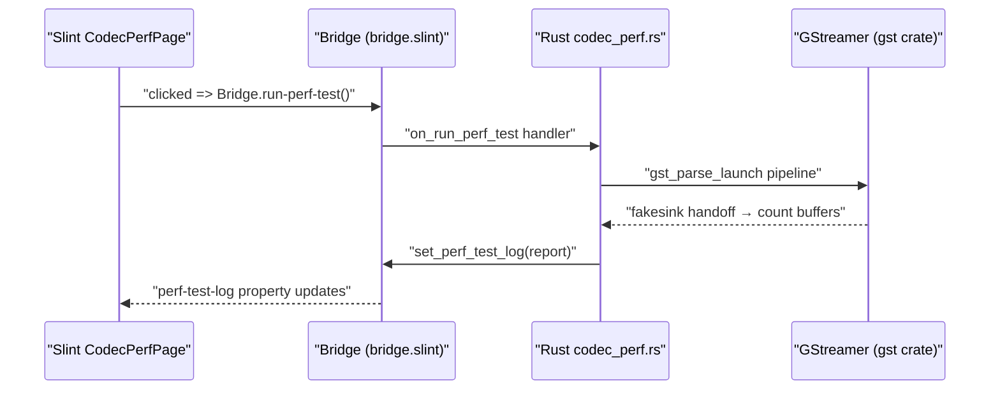

Here are complete drop-in code snippets for a new **Codec Performance Test** page that benchmarks GStreamer `androidmedia` encode/decode pipelines.

---

## Architecture



The benchmark runs entirely in **Rust** using the `gst` crate (GStreamer is already initialized in-process). No extra C JNI library needed. [3-cite-0](#3-cite-0) 

Here are all complete, drop-in code snippets. Note: **no Kotlin is needed** for this page — the benchmark runs entirely in Rust via the `gst` crate since GStreamer is already initialized in-process. [4-cite-0](#4-cite-0) 

---

## File 1: `ui/bridge.slint` — Add `codec-perf` to Panel enum

At line 138, before the closing `}` of `export enum Panel`: [4-cite-1](#4-cite-1) 

```slint
export enum Panel {
    none,
    settings,
    debug,
    codec-test,
    codec-perf,          // ← ADD THIS LINE
    backup-reset,
    audio,
    camera,
    quick-actions,
    cast-history,
    cast-history-detail,
    recording,
    pairing,
    receiver-rename,
    bitrate-presets,
    bitrate-preset-edit,
    macros,
    macro-edit,
    debug-log,
    debug-video,
    network,
    mixer,
    media-backend,
    test-functionality,
    camera-rtmp-stream,
    rtmp-wizard,
}
```

---

## File 2: `ui/bridge.slint` — Add Bridge properties/callbacks

Insert before the `// ── Public functions` block at line 462: [4-cite-2](#4-cite-2) 

```slint
    // ── Codec performance benchmark (GStreamer pipeline throughput) ───────
    in property <string> perf-test-log: "";
    in property <bool>   perf-test-running: false;
    callback run-perf-test();
    callback run-perf-encode-only();
    callback run-perf-decode-only();
    callback run-perf-list-factories();

    // ── Public functions (callable from Slint) ───────────────────────────
    public function change-state(to: AppState) {
        Bridge.app-state = to;
    }
}
```

---

## File 3: `ui/main.slint` — Import + route

Add import after line 70: [4-cite-3](#4-cite-3) 

```slint
import { CodecTestPage }                from "pages/codec_test_page.slint";
import { CodecPerfPage }                from "pages/codec_perf_page.slint";   // ← ADD
import { FullDebugPage }                from "pages/debug_page.slint";
```

Add route inside `PanelHost` after line 178: [4-cite-4](#4-cite-4) 

```slint
            if PanelBridge.active == Panel.codec-test:          CodecTestPage           { }
            if PanelBridge.active == Panel.codec-perf:          CodecPerfPage           { }   // ← ADD
```

---

## File 4: `ui/pages/settings_page.slint` — Add entry point

Insert after the "H.264 encoder test" row (after line 340): [4-cite-5](#4-cite-5) 

```slint
                    SettingsValueRow {
                        icon: "🧪";
                        icon-bg: Theme.icon-bg-neutral;
                        title: @tr("H.264 encoder test");
                        value: @tr("open-panel-action" => "Open");
                        clicked => { PanelBridge.push(Panel.codec-test); }
                    }
                    SettingsValueRow {
                        icon: "⚡";
                        icon-bg: Theme.icon-bg-neutral;
                        title: @tr("Codec performance test");
                        value: @tr("open-panel-action" => "Open");
                        clicked => { PanelBridge.push(Panel.codec-perf); }
                    }
                    SettingsValueRow {
                        icon: "📋";
                        icon-bg: Theme.icon-bg-neutral;
                        title: @tr("Debug log");
                        value: @tr("open-panel-action" => "Open");
                        clicked => { PanelBridge.push(Panel.debug-log); }
                    }
```

---

## File 5: `ui/pages/codec_perf_page.slint` (NEW)

**New file:** `ui/pages/codec_perf_page.slint`

```slint
// codec_perf_page.slint — GStreamer codec pipeline performance benchmark.
//
// Runs real GStreamer encode/decode pipelines using androidmedia (AMC) elements,
// counts buffers reaching fakesink, and reports throughput in FPS.
//
// Reachable from FullSettingsPage's "Codec performance test" row, which sets
// `PanelBridge.push(Panel.codec-perf)`.

import { ScrollView } from "std-widgets.slint";
import { Bridge, Panel } from "../bridge.slint";
import { PanelBridge } from "../state/panel_bridge.slint";
import { Theme } from "../theme.slint";
import { PrimaryButton, DestructiveButton, TextButton } from "../components/buttons.slint";
import { PanelHeader } from "../components/panel_chrome.slint";

export component CodecPerfPage inherits Rectangle {
    width: 100%;
    height: 100%;
    background: Theme.surface-primary;

    VerticalLayout {
        // ── Header ────────────────────────────────────────────────────────
        PanelHeader {
            title: @tr("Codec performance");
            close-clicked => { PanelBridge.pop(); }
        }

        // ── Body ──────────────────────────────────────────────────────────
        VerticalLayout {
            padding: Theme.padding-screen;
            spacing: Theme.spacing-default;

            // ── Buttons row 1 ─────────────────────────────────────────────
            HorizontalLayout {
                spacing: Theme.spacing-default;

                PrimaryButton {
                    label: Bridge.perf-test-running
                        ? @tr("Running…")
                        : @tr("Full benchmark");
                    enabled: !Bridge.perf-test-running;
                    clicked => { Bridge.run-perf-test(); }
                    horizontal-stretch: 1;
                }

                PrimaryButton {
                    label: @tr("List factories");
                    enabled: !Bridge.perf-test-running;
                    clicked => { Bridge.run-perf-list-factories(); }
                    horizontal-stretch: 1;
                }
            }

            // ── Buttons row 2 ─────────────────────────────────────────────
            HorizontalLayout {
                spacing: Theme.spacing-default;

                PrimaryButton {
                    label: @tr("Encode only");
                    enabled: !Bridge.perf-test-running;
                    clicked => { Bridge.run-perf-encode-only(); }
                    horizontal-stretch: 1;
                }

                PrimaryButton {
                    label: @tr("Decode only");
                    enabled: !Bridge.perf-test-running;
                    clicked => { Bridge.run-perf-decode-only(); }
                    horizontal-stretch: 1;
                }
            }

            // ── Log output ────────────────────────────────────────────────
            ScrollView {
                mouse-drag-pan-enabled: true;
                vertical-stretch: 1;
                Text {
                    text: Bridge.perf-test-log == ""
                        ? @tr("Benchmarks GStreamer androidmedia encode/decode pipelines.\n\nMeasures real throughput (FPS) by counting buffers at fakesink.\n\nPress a button above to start.")
                        : Bridge.perf-test-log;
                    color: Theme.text-secondary;
                    font-size: Theme.font-size-label;
                    wrap: word-wrap;
                }
            }
        }
    }
}
```

---

## File 6: `src/codec_perf.rs` (NEW)

**New file:** `src/codec_perf.rs`

```rust
//! Codec performance benchmark — runs GStreamer encode/decode pipelines
//! and measures throughput by counting buffers at fakesink.
//!
//! Uses the `gst` crate (already available in-process after
//! `ensure_gstreamer_initialized()`).  The `androidmedia` plugin provides
//! `amcvidenc-*` / `amcviddec-*` factories backed by Android MediaCodec.

use std::sync::atomic::{AtomicU64, Ordering};
use std::sync::Arc;
use std::time::{Duration, Instant};
use tracing::{error, info, warn};

// ─── BenchResult ─────────────────────────────────────────────────────────────

/// Result of a single pipeline benchmark run.
#[derive(Debug, Clone)]
pub struct BenchResult {
    pub name: String,
    pub ok: bool,
    pub fps: f64,
    pub buffers: u64,
    pub seconds: f64,
    pub error: String,
    pub pipeline_desc: String,
}

impl BenchResult {
    fn failure(name: &str, pipeline_desc: &str, error: String) -> Self {
        Self {
            name: name.to_string(),
            ok: false,
            fps: 0.0,
            buffers: 0,
            seconds: 0.0,
            error,
            pipeline_desc: pipeline_desc.to_string(),
        }
    }
}

impl std::fmt::Display for BenchResult {
    fn fmt(&self, f: &mut std::fmt::Formatter<'_>) -> std::fmt::Result {
        if self.ok {
            write!(
                f,
                "{}: {:.1} fps ({} buffers in {:.2}s)",
                self.name, self.fps, self.buffers, self.seconds
            )
        } else {
            write!(f, "{}: FAILED — {}", self.name, self.error)
        }
    }
}

// ─── Core benchmark runner ───────────────────────────────────────────────────

/// Run a GStreamer pipeline and count buffers reaching `fakesink name=sink`.
/// Returns after EOS, error, or timeout.
pub fn run_pipeline_benchmark(
    name: &str,
    pipeline_desc: &str,
    timeout: Duration,
) -> BenchResult {
    use gst::prelude::*;

    info!("perf-bench starting: {name}\n  pipeline: {pipeline_desc}");

    // Ensure GStreamer is initialized (idempotent)
    if let Err(e) = crate::platform::gst_init::ensure_gstreamer_initialized() {
        return BenchResult::failure(name, pipeline_desc, format!("GStreamer init failed: {e}"));
    }

    let pipeline = match gst::parse::launch(pipeline_desc) {
        Ok(elem) => elem,
        Err(e) => {
            return BenchResult::failure(
                name,
                pipeline_desc,
                format!("parse_launch failed: {e}"),
            );
        }
    };

    let pipeline = match pipeline.downcast::<gst::Pipeline>() {
        Ok(p) => p,
        Err(_) => {
            return BenchResult::failure(
                name,
                pipeline_desc,
                "parsed element is not a Pipeline".into(),
            );
        }
    };

    // Find the fakesink named "sink"
    let sink = match pipeline.by_name("sink") {
        Some(s) => s,
        None => {
            return BenchResult::failure(
                name,
                pipeline_desc,
                "pipeline must contain: fakesink name=sink".into(),
            );
        }
    };

    // Disable sync so we measure raw throughput
    sink.set_property("sync", false);
    sink.set_property("async", false);

    // Buffer counter using a pad probe on sink's sink pad
    let buffer_count = Arc::new(AtomicU64::new(0));
    let first_buffer_time = Arc::new(parking_lot::Mutex::new(None::<Instant>));
    let last_buffer_time = Arc::new(parking_lot::Mutex::new(None::<Instant>));

    let count_clone = buffer_count.clone();
    let first_clone = first_buffer_time.clone();
    let last_clone = last_buffer_time.clone();

    let sink_pad = sink
        .static_pad("sink")
        .expect("fakesink must have a sink pad");

    sink_pad.add_probe(gst::PadProbeType::BUFFER, move |_pad, _info| {
        let now = Instant::now();
        let n = count_clone.fetch_add(1, Ordering::Relaxed);
        if n == 0 {
            *first_clone.lock() = Some(now);
        }
        *last_clone.lock() = Some(now);
        gst::PadProbeReturn::Ok
    });

    // Start pipeline
    if let Err(e) = pipeline.set_state(gst::State::Playing) {
        return BenchResult::failure(
            name,
            pipeline_desc,
            format!("set_state(Playing) failed: {e:?}"),
        );
    }

    // Wait for EOS or error or timeout
    let bus = pipeline.bus().expect("pipeline must have a bus");
    let deadline = Instant::now() + timeout;
    let mut got_eos = false;
    let mut got_error: Option<String> = None;

    loop {
        let remaining = deadline.saturating_duration_since(Instant::now());
        if remaining.is_zero() {
            info!("perf-bench {name}: timed out after {timeout:?}");
            break;
        }

        match bus.timed_pop(gst::ClockTime::from_mseconds(
            remaining.as_millis().min(u64::MAX as u128) as u64,
        )) {
            Some(msg) => match msg.view() {
                gst::MessageView::Eos(_) => {
                    got_eos = true;
                    break;
                }
                gst::MessageView::Error(e) => {
                    got_error = Some(format!(
                        "{} (debug: {})",
                        e.error(),
                        e.debug().unwrap_or_default()
                    ));
                    break;
                }
                _ => {}
            },
            None => {
                // timed_pop returned None → timeout
                break;
            }
        }
    }

    // Stop pipeline
    let _ = pipeline.set_state(gst::State::Null);

    // Calculate results
    let buffers = buffer_count.load(Ordering::Relaxed);
    let first = *first_buffer_time.lock();
    let last = *last_buffer_time.lock();

    let (seconds, fps) = match (first, last) {
        (Some(f), Some(l)) if buffers > 1 && l > f => {
            let secs = (l - f).as_secs_f64();
            let fps_val = (buffers as f64) / secs;
            (secs, fps_val)
        }
        _ => (0.0, 0.0),
    };

    if let Some(err) = got_error {
        error!("perf-bench {name}: pipeline error: {err}");
        return BenchResult {
            name: name.to_string(),
            ok: false,
            fps,
            buffers,
            seconds,
            error: err,
            pipeline_desc: pipeline_desc.to_string(),
        };
    }

    let result = BenchResult {
        name: name.to_string(),
        ok: buffers > 0,
        fps,
        buffers,
        seconds,
        error: String::new(),
        pipeline_desc: pipeline_desc.to_string(),
    };

    info!("perf-bench result: {result}");
    result
}

// ─── Factory discovery ───────────────────────────────────────────────────────

/// List all GStreamer androidmedia (amc*) and codec-related factories.
pub fn list_codec_factories() -> String {
    use gst::prelude::*;

    if let Err(e) = crate::platform::gst_init::ensure_gstreamer_initialized() {
        return format!("GStreamer init failed: {e}\n");
    }

    let registry = gst::Registry::get();
    let mut report = String::new();
    report.push_str("===== GStreamer Codec Factories =====\n\n");

    let mut codec_factories: Vec<(String, String, gst::Rank)> = Vec::new();

    let all_factories = gst::ElementFactory::factories_with_type(
        gst::ElementFactoryType::ANY,
        gst::Rank::NONE,
    );

    for factory in &all_factories {
        let name = factory.name().to_string();
        let dominated = name.starts_with("amc")
            || name.contains("h264")
            || name.contains("h265")
            || name.contains("hevc")
            || name.contains("vp8")
            || name.contains("vp9")
            || name.contains("av1")
            || name.contains("x264")
            || name.contains("x265")
            || name.contains("openh264");

        if dominated {
            let klass = factory
                .metadata("klass")
                .unwrap_or_default()
                .to_string();
            let rank = factory.rank();
            codec_factories.push((name, klass, rank));
        }
    }

    codec_factories.sort_by(|a, b| a.0.cmp(&b.0));

    // Separate encoders and decoders
    report.push_str("── Encoders ──\n");
    for (name, klass, rank) in &codec_factories {
        if klass.contains("Encoder") {
            report.push_str(&format!("  {name} | rank={rank:?} | {klass}\n"));
        }
    }

    report.push_str("\n── Decoders ──\n");
    for (name, klass, rank) in &codec_factories {
        if klass.contains("Decoder") {
            report.push_str(&format!("  {name} | rank={rank:?} | {klass}\n"));
        }
    }

    report.push_str("\n── Other (parsers/muxers) ──\n");
    for (name, klass, rank) in &codec_factories {
        if !klass.contains("Encoder") && !klass.contains("Decoder") {
            report.push_str(&format!("  {name} | rank={rank:?} | {klass}\n"));
        }
    }

    report.push_str(&format!(
        "\nTotal codec-related factories: {}\n",
        codec_factories.len()
    ));
    report
}

// ─── Factory finders ─────────────────────────────────────────────────────────

/// Find the best androidmedia encoder factory for a given codec hint
/// (e.g. "avc", "hevc", "h264", "h265").
fn find_amc_encoder(codec_hint: &str) -> Option<String> {
    use gst::prelude::*;

    let factories = gst::ElementFactory::factories_with_type(
        gst::ElementFactoryType::ENCODER | gst::ElementFactoryType::MEDIA_VIDEO,
        gst::Rank::NONE,
    );

    let mut candidates: Vec<(String, gst::Rank)> = Vec::new();

    for factory in &factories {
        let name = factory.name().to_string();
        if name.starts_with("amcvidenc") && name.contains(codec_hint) {
            candidates.push((name, factory.rank()));
        }
    }

    // Sort by rank descending (highest rank = preferred)
    candidates.sort_by(|a, b| b.1.cmp(&a.1));
    candidates.into_iter().next().map(|(name, _)| name)
}

/// Find the best androidmedia decoder factory for a given codec hint.
fn find_amc_decoder(codec_hint: &str) -> Option<String> {
    use gst::prelude::*;

    let factories = gst::ElementFactory::factories_with_type(
        gst::ElementFactoryType::DECODER | gst::ElementFactoryType::MEDIA_VIDEO,
        gst::Rank::NONE,
    );

    let mut candidates: Vec<(String, gst::Rank)> = Vec::new();

    for factory in &factories {
        let name = factory.name().to_string();
        if name.starts_with("amcviddec") && name.contains(codec_hint) {
            candidates.push((name, factory.rank()));
        }
    }

    candidates.sort_by(|a, b| b.1.cmp(&a.1));
    candidates.into_iter().next().map(|(name, _)| name)
}

// ─── Pipeline builders ───────────────────────────────────────────────────────

/// Encode benchmark: videotestsrc → videoconvert → amcvidenc-* → parser → fakesink
fn encode_pipeline(
    encoder: &str,
    width: u32,
    height: u32,
    fps: u32,
    bitrate: u32,
    parser: &str,
) -> String {
    format!(
        "videotestsrc is-live=false num-buffers=300 pattern=smpte ! \
         video/x-raw,width={width},height={height},framerate={fps}/1 ! \
         queue max-size-buffers=5 ! \
         videoconvert ! \
         {encoder} bitrate={bitrate} ! \
         {parser} ! \
         fakesink name=sink sync=false async=false"
    )
}

/// Decode benchmark: videotestsrc → encoder → parser → decoder → fakesink
/// (encode-then-decode roundtrip avoids needing a test file on device)
fn encode_decode_pipeline(
    encoder: &str,
    decoder: &str,
    width: u32,
    height: u32,
    fps: u32,
    bitrate: u32,
    parser: &str,
) -> String {
    format!(
        "videotestsrc is-live=false num-buffers=300 pattern=smpte ! \
         video/x-raw,width={width},height={height},framerate={fps}/1 ! \
         queue max-size-buffers=5 ! \
         videoconvert ! \
         {encoder} bitrate={bitrate} ! \
         {parser} ! \
         queue max-size-buffers=10 ! \
         {decoder} ! \
         videoconvert ! \
         fakesink name=sink sync=false async=false"
    )
}

// ─── Benchmark suites ────────────────────────────────────────────────────────

/// Best result from a list of BenchResults.
fn best_result(results: &[BenchResult]) -> Option<&BenchResult> {
    results
        .iter()
        .filter(|r| r.ok && r.fps > 0.0)
        .max_by(|a, b| a.fps.partial_cmp(&b.fps).unwrap_or(std::cmp::Ordering::Equal))
}

/// Run the full encode benchmark suite.
pub fn run_encode_benchmarks() -> String {
    let timeout = Duration::from_secs(30);
    let mut report = String::new();
    report.push_str("===== ENCODE BENCHMARK =====\n\n");

    // Find AVC encoder
    let avc_enc = find_amc_encoder("avc").or_else(|| find_amc_encoder("h264"));
    // Find HEVC encoder
    let hevc_enc = find_amc_encoder("hevc").or_else(|| find_amc_encoder("h265"));

    report.push_str(&format!(
        "AVC encoder:  {}\n",
        avc_enc.as_deref().unwrap_or("NOT FOUND")
    ));
    report.push_str(&format!(
        "HEVC encoder: {}\n\n",
        hevc_enc.as_deref().unwrap_or("NOT FOUND")
    ));

    let mut results: Vec<BenchResult> = Vec::new();

    if let Some(ref enc) = avc_enc {
        let tests: [(& str, u32, u32, u32, u32); 3] = [
            ("AVC 1280x720@30", 1280, 720, 30, 2_000_000),
            ("AVC 1920x1080@30", 1920, 1080, 30, 4_000_000),
            ("AVC 1920x1080@60", 1920, 1080, 60, 6_000_000),
        ];
        for (name, w, h, fps, bitrate) in tests {
            let desc = encode_pipeline(enc, w, h, fps, bitrate, "h264parse");
            let result = run_pipeline_benchmark(name, &desc, timeout);
            report.push_str(&format!("{result}\n"));
            results.push(result);
        }
    }

    report.push('\n');

    if let Some(ref enc) = hevc_enc {
        let tests: [(&str, u32, u32, u32, u32); 3] = [
            ("HEVC 1280x720@30", 1280, 720, 30, 1_500_000),
            ("HEVC 1920x1080@30", 1920, 1080, 30, 3_000_000),
            ("HEVC 1920x1080@60", 1920, 1080, 60, 5_000_000),
        ];
        for (name, w, h, fps, bitrate) in tests {
            let desc = encode_pipeline(enc, w, h, fps, bitrate, "h265parse");
            let result = run_pipeline_benchmark(name, &desc, timeout);
            report.push_str(&format!("{result}\n"));
            results.push(result);
        }
    }

    // Fallback: try x264enc if no AMC encoder found
    if avc_enc.is_none() && hevc_enc.is_none() {
        report.push_str("\nNo AMC encoders found. Trying software x264enc...\n");
        let desc = encode_pipeline(
            "x264enc speed-preset=ultrafast tune=zerolatency",
            1280,
            720,
            30,
            2_000_000,
            "h264parse",
        );
        let result = run_pipeline_benchmark("x264 sw 1280x720@30", &desc, timeout);
        report.push_str(&format!("{result}\n"));
        results.push(result);
    }

    // Summary
    report.push_str("\n── BEST ENCODE RESULT ──\n");
    if let Some(best) = best_result(&results) {
        report.push_str(&format!("{best}\n"));
        report.push_str(&format!("  pipeline: {}\n", best.pipeline_desc));
    } else {
        report.push_str("No encoder pipeline succeeded.\n");
    }

    report
}

/// Run the full decode benchmark suite (encode→decode roundtrip).
pub fn run_decode_benchmarks() -> String {
    let timeout = Duration::from_secs(30);
    let mut report = String::new();
    report.push_str("===== DECODE BENCHMARK =====\n\n");

    let avc_enc = find_amc_encoder("avc").or_else(|| find_amc_encoder("h264"));
    let avc_dec = find_amc_decoder("avc").or_else(|| find_amc_decoder("h264"));
    let hevc_enc = find_amc_encoder("hevc").or_else(|| find_amc_encoder("h265"));
    let hevc_dec = find_amc_decoder("hevc").or_else(|| find_amc_decoder("h265"));

    report.push_str(&format!(
        "AVC encoder:  {}\n",
        avc_enc.as_deref().unwrap_or("NOT FOUND")
    ));
    report.push_str(&format!(
        "AVC decoder:  {}\n",
        avc_dec.as_deref().unwrap_or("NOT FOUND")
    ));
    report.push_str(&format!(
        "HEVC encoder: {}\n",
        hevc_enc.as_deref().unwrap_or("NOT FOUND")
    ));
    report.push_str(&format!(
        "HEVC decoder: {}\n\n",
        hevc_dec.as_deref().unwrap_or("NOT FOUND")
    ));

    let mut results: Vec<BenchResult> = Vec::new();

    // AVC encode→decode roundtrip
    if let (Some(ref enc), Some(ref dec)) = (&avc_enc, &avc_dec) {
        let tests: [(&str, u32, u32, u32, u32); 2] = [
            ("AVC decode 1280x720@30", 1280, 720, 30, 2_000_000),
            ("AVC decode 1920x1080@30", 1920, 1080, 30, 4_000_000),
        ];
        for (name, w, h, fps, bitrate) in tests {
            let desc = encode_decode_pipeline(enc, dec, w, h, fps, bitrate, "h264parse");
            let result = run_pipeline_benchmark(name, &desc, timeout);
            report.push_str(&format!("{result}\n"));
            results.push(result);
        }
    }

    report.push('\n');

    // HEVC encode→decode roundtrip
    if let (Some(ref enc), Some(ref dec)) = (&hevc_enc, &hevc_dec) {
        let tests: [(&str, u32, u32, u32, u32); 2] = [
            ("HEVC decode 1280x720@30", 1280, 720, 30, 1_500_000),
            ("HEVC decode 1920x1080@30", 1920, 1080, 30, 3_000_000),
        ];
        for (name, w, h, fps, bitrate) in tests {
            let desc = encode_decode_pipeline(enc, dec, w, h, fps, bitrate, "h265parse");
            let result = run_pipeline_benchmark(name, &desc, timeout);
            report.push_str(&format!("{result}\n"));
            results.push(result);
        }
    }

    // Summary
    report.push_str("\n── BEST DECODE RESULT ──\n");
    if let Some(best) = best_result(&results) {
        report.push_str(&format!("{best}\n"));
        report.push_str(&format!("  pipeline: {}\n", best.pipeline_desc));
    } else {
        report.push_str("No decode pipeline succeeded.\n");
    }

    report
}

/// Run all benchmarks: list factories, encode, decode, and recommendation.
pub fn run_full_benchmark() -> String {
    let mut report = String::new();

    report.push_str(&list_codec_factories());
    report.push('\n');
    report.push_str(&run_encode_benchmarks());
    report.push('\n');
    report.push_str(&run_decode_benchmarks());

    // Final recommendation
    report.push_str("\n===== RECOMMENDATION =====\n");

    let avc_enc = find_amc_encoder("avc").or_else(|| find_amc_encoder("h264"));
    let hevc_enc = find_amc_encoder("hevc").or_else(|| find_amc_encoder("h265"));

    if avc_enc.is_some() && hevc_enc.is_some() {
        report.push_str("Both AVC and HEVC HW encoders available.\n");
        report.push_str("  AVC:  best compatibility, lower latency on most devices.\n");
        report.push_str("  HEVC: better compression at same quality, use if receiver supports it.\n");
        report.push_str("Compare FPS numbers above to decide.\n");
    } else if avc_enc.is_some() {
        report.push_str("Only AVC HW encoder available. Use H.264 for streaming.\n");
    } else if hevc_enc.is_some() {
        report.push_str("Only HEVC HW encoder available. Use H.265 for streaming.\n");
    } else {
        report.push_str("No HW encoder found! Software x264enc fallback will have lower performance.\n");
    }

    report
}
```

---

## File 7: `src/lib.rs` — Register module

Add `pub mod codec_perf;` after line 16: [4-cite-6](#4-cite-6) 

```rust
pub mod app;
pub mod application;
pub mod codec_perf;          // ← ADD THIS LINE
pub mod command;
pub mod config;
pub mod jni_bridge;
pub mod log_ring;
pub mod platform;
pub mod secret;

#[cfg(target_os = "android")]
mod android_main;

mod backend;
mod gstpop_service;
mod migration_service;
```

---

## File 8: `src/android_main.rs` — Wire Bridge callbacks

Insert after the `on_pick_test_overlay_image` handler (after line 1199), before the `use crate::jni_bridge::camera::` block: [4-cite-7](#4-cite-7) 

```rust
    // ── Codec performance benchmark callbacks ────────────────────────────
    ui.global::<Bridge>().on_run_perf_test({
        let ui_weak = ui.as_weak();
        move || {
            let _ = ui_weak.upgrade_in_event_loop(|ui| {
                ui.global::<Bridge>().set_perf_test_running(true);
                ui.global::<Bridge>().set_perf_test_log(
                    "Running full codec benchmark…\nThis may take 1-2 minutes.\n".into(),
                );
            });
            let ui_inner = ui_weak.clone();
            std::thread::spawn(move || {
                let report = crate::codec_perf::run_full_benchmark();
                let _ = ui_inner.upgrade_in_event_loop(move |ui| {
                    ui.global::<Bridge>().set_perf_test_log(report.into());
                    ui.global::<Bridge>().set_perf_test_running(false);
                });
            });
        }
    });

    ui.global::<Bridge>().on_run_perf_encode_only({
        let ui_weak = ui.as_weak();
        move || {
            let _ = ui_weak.upgrade_in_event_loop(|ui| {
                ui.global::<Bridge>().set_perf_test_running(true);
                ui.global::<Bridge>()
                    .set_perf_test_log("Running encode benchmark…\n".into());
            });
            let ui_inner = ui_weak.clone();
            std::thread::spawn(move || {
                let report = crate::codec_perf::run_encode_benchmarks();
                let _ = ui_inner.upgrade_in_event_loop(move |ui| {
                    ui.global::<Bridge>().set_perf_test_log(report.into());
                    ui.global::<Bridge>().set_perf_test_running(false);
                });
            });
        }
    });

    ui.global::<Bridge>().on_run_perf_decode_only({
        let ui_weak = ui.as_weak();
        move || {
            let _ = ui_weak.upgrade_in_event_loop(|ui| {
                ui.global::<Bridge>().set_perf_test_running(true);
                ui.global::<Bridge>()
                    .set_perf_test_log("Running decode benchmark…\n".into());
            });
            let ui_inner = ui_weak.clone();
            std::thread::spawn(move || {
                let report = crate::codec_perf::run_decode_benchmarks();
                let _ = ui_inner.upgrade_in_event_loop(move |ui| {
                    ui.global::<Bridge>().set_perf_test_log(report.into());
                    ui.global::<Bridge>().set_perf_test_running(false);
                });
            });
        }
    });

    ui.global::<Bridge>().on_run_perf_list_factories({
        let ui_weak = ui.as_weak();
        move || {
            let _ = ui_weak.upgrade_in_event_loop(|ui| {
                ui.global::<Bridge>().set_perf_test_running(true);
                ui.global::<Bridge>()
                    .set_perf_test_log("Listing GStreamer codec factories…\n".into());
            });
            let ui_inner = ui_weak.clone();
            std::thread::spawn(move || {
                let report = crate::codec_perf::list_codec_factories();
                let _ = ui_inner.upgrade_in_event_loop(move |ui| {
                    ui.global::<Bridge>().set_perf_test_log(report.into());
                    ui.global::<Bridge>().set_perf_test_running(false);
                });
            });
        }
    });

    use crate::jni_bridge::camera::{
        upcall_start_camera_capture, upcall_start_camera_preview, upcall_stop_camera_capture,
        upcall_stop_camera_preview,
    };
```

---

## Summary

| Action | File | What |
|--------|------|------|
| **Edit** | `ui/bridge.slint:118` | Add `codec-perf,` to `Panel` enum |
| **Edit** | `ui/bridge.slint:~461` | Add 6 properties/callbacks before closing `}` |
| **Edit** | `ui/main.slint:~71` | Add `CodecPerfPage` import |
| **Edit** | `ui/main.slint:~179` | Add `Panel.codec-perf` route |
| **Edit** | `ui/pages/settings_page.slint:~340` | Add "Codec performance test" row |
| **New** | `ui/pages/codec_perf_page.slint` | Full Slint page |
| **New** | `src/codec_perf.rs` | GStreamer benchmark module |
| **Edit** | `src/lib.rs:~11` | Add `pub mod codec_perf;` |
| **Edit** | `src/android_main.rs:~1199` | Add 4 callback handlers |

Key design decisions:
- **No Kotlin/JNI needed** — GStreamer `gst` crate is already available in Rust. The `androidmedia` plugin is in `Android.mk` so `amcvidenc-*`/`amcviddec-*` factories register automatically. [4-cite-8](#4-cite-8) 
- Uses `parking_lot::Mutex` (already a dependency) instead of `std::sync::Mutex` for the buffer timing, matching codebase conventions. [4-cite-9](#4-cite-9) 
- Uses `std::thread::spawn` for blocking GStreamer operations, matching the pattern used by existing handlers. [4-cite-10](#4-cite-10) 
- Calls `ensure_gstreamer_initialized()` inside the benchmark functions as a safety net. [4-cite-11](#4-cite-11)
